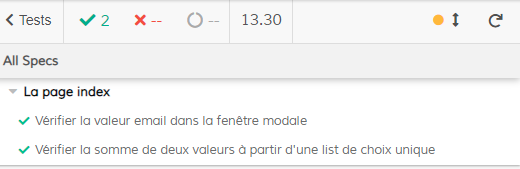

- [Introduction](#introduction)
  - [Connaissances essentielles](#connaissances-essentielles)
- [Prérequis](#prérequis)
  - [NodeJs](#nodejs)
  - [npm](#npm)
  - [Cypress](#cypress)
  - [git](#git)
  - [Visual Studio Code](#visual-studio-code)
  - [serve](#serve)
- [Vérification de l'environnement](#vérification-de-lenvironnement)
- [Tester avec Cypress](#tester-avec-cypress)
  - [Structure d'un script de test](#structure-dun-script-de-test)
  - [Structure d'un projet de test](#structure-dun-projet-de-test)
  - [AAA: Arrange, Act, Assert](#aaa-arrange-act-assert)
  - [Application du paradigme AAA](#application-du-paradigme-aaa)

# Introduction 
[Cypress](http://cypress.io) est un outil de test fonctionnel dit End-to-End (e2e). Il permet d'automatiser les taches de manipulation et d'interaction avec l'application WEB. L'objective de ce répertoire et de proposer une introduction à l'outil et les étapes nécessaires pour l'installer et commencer à rédiger et exécuter des scripts de test. 
## Connaissances essentielles
Le development des scripts de test pour Cypress demande une connaissance du langage Javascript et une expérience avec l'outil de gestion des dépendances [npm](https://www.npmjs.com/get-npm). De plus, la syntaxe de [selection de jQuery](https://api.jquery.com/category/selectors/) est également indispensable. Son utilité sera discutée dans les paragraphes suivants.

# Prérequis
Les outils suivants sont nécessaires pour se lancer dans Cypress.
## NodeJs
A télécharger depuis [nodejs.org](https://nodejs.org/en/download/). Il est conçu initialement pour exécuter Javascript au niveau du serveur (i.e: serveur WEB JS). On l'utilise ajourd'hui pour exécuter des scripts Javascript et Typescript localement sans besoin d'un navigateur WEB. Vérifier l'installation avec la commande\
 `node -v` \
.

## npm
Géstionnaire de dépendances des applications JS. Pour chaque project géré par `npm` on lui attache un fichier `package.json` qui comporte toutes les informations relatives à l'application (version, description, dépendances, commandes à exécuter, [etc.](https://docs.npmjs.com/cli/v7/configuring-npm/package-json)). `npm` est inclus avec Node.  
Vérifier l'installation avec la commande:\
 `node -v`\
. 

## Cypress
Outil de test e2e. Permet l'exécution des script de test JS. Il offre une interface graphique qui aide à visualiser et suivre l'exécution du test. Un avantage majeur de Cypress est la possibilité d'inspecter l'état du test à un moment donné via des Snapshots. L'outil est à installer avec `npm` globalement (pour que la commande:\
 `cypress open`\
 soit accessible n'import où sur votre machine). La commande d'installation est:\
`npm install cyress -g`\
Vérifier l'installation avec la commande:\
 `cypress -v`\

## git
`git` est un système de gestion de versions. Il permet de suivre l'évolution d'un projet et de restaurer une version précédente du même projet sans perdre l'état actuel. `git` est un outil essentiel pour le development en équipe, où chaque membre reçoit  une copie (via `git clone`) d'un répertoire dit `remote`. La version d'origine du projet est modifiée après un `commit` suivi d'un `push` depuis la version locale.  
Télécharger et installer `git` depuis [git-scm.com](https://git-scm.com/download). Vérifier l'installation avec la commande:\
`git --version`\
\
Nous allons utiliser `git` pour avoir une copie de ce répertoire.
## Visual Studio Code
VSCode est un environnement de development intégré (IDE) gratuit développé par Microsoft. Voir les extensions conçues pour le development des scripts Cypress, il est recommandé  d'utiliser VSCode au lieu d'un éditeur de texte basique. A télécharger et installer depuis [visualstudio.com](https://code.visualstudio.com/download). Ensuite ajouter depuis l'onglet des extensions [*Cypress Snippets*](https://marketplace.visualstudio.com/items?itemName=andrew-codes.cypress-snippets). Ce dernier va nous permettre d'accélérer le development des scripts Cypress par des raccourcies et la saisie automatique.

## serve
`serve` est un utilitaire légère pour la création des serveurs WEB locaux à partir des fichiers source statiques. Ce répertoire contient une page WEB statique  qu'on va utiliser comme sujet de test. `serve` va nous permettre de lancer un serveur local sur l'adresse `http://localhost:PORT/`. Cypress va naviguer vers cette adresse pour effectuer les tests proposés. Commande d'installation :\
`npm i serve -g`\
Vérifier l'installation par la commande:\
`serve -v`\


# Vérification de l'environnement
Pour vérifier l'intégralité de notre environnement du travail on propose de lancer un premier test. Commencer par cloner ce repértoire par la commande suivante:\
`git clone https://github.com/ALLAOUI-DSI/cypress.git` \
Vous serez ramener à saisir votre identifiant et mot de passe Github. Une fois fait, ouvrez le dossier dans VSCode et lancer un nouveau terminal pour installer les dépendances nécessaires par la commande suivante:\
`npm install` \
Attention au dossier du travail. La commande précédente doit être exécutée depuis le dossier racine du projet (crée par la commande `git`). Ensuite, on démarre le serveur local par la commande suivante:\
`npm run local`\
Cette commande va lancer un script définit dans le fichier `package.json`. Elle est équivalente à la commande suivante:\
`serve --port=2021`\
(Si vous modifiez le port, vous devrez modifier également les liens dans les fichiers de  test `*.spec.js`).\
Vérifiez le lancement du serveur local en accédant à la page http://localhost:2021/  
Ensuite, on ajoute une nouvelle fenêtre du terminal pour lancer les scripts de test. Dans le nouveau terminal lancer la commande suivante:\
`npm run cy:open` \
Cette commande est équivalente à la commande suivante:\
`cypress open` \
Depuis l'interface graphique de Cypress lancez l'exécution des tests.\
 \
Une nouvelle fenêtre du navigateur va être affichée où les tests serons exécutés.\

# Tester avec Cypress
## Structure d'un script de test
Un fichier de test Cypress est un script JS intitulé par convention `PAGE.spec.js` alors chaque page de l'application WEB on lui associe un script de test. Le script contient un ou plusieurs tests à exécuter. Chaque script est composé d'un objet `context()` qui encapsule tous les tests définis par des fonctions `it()`. Chaque définition de `it()` est un test à exécuter indépendamment d'autre test. Le code suivant représente un exemple basique d'un script de test:\
````
context('Description de la suite de tests', () => {
    it('Description du test 1', () => {
        // ...
    }
    it('Description du test 2', () => {
        // ...
    }
}
````

## Structure d'un projet de test
Les fichiers au sien d'un projet Cypress sont organisés suivant la [hiérarchie](https://docs.cypress.io/guides/core-concepts/writing-and-organizing-tests.html) suivante:
````
Intitulé du projet/
├─ cypress/
│  ├─ fixtures/
│  │  ├─ exemple_donnee.json
│  ├─ integration/
│  │  ├─ exemple_page_1.spec.js
│  │  ├─ exemple_page_2.spec.js
│  ├─ plugins/
│  ├─ support/
├─ package.json
├─ cypress.json
````
Le fichier `cypress.json` et le dossier `cypress` sont généré automatiquement après la première execution de la commande `cypress open`. Le fichier `cypress.json` est un fichier de [configuration](https://docs.cypress.io/guides/references/configuration.html) de Cypress, là où on modifie les paramètres d'exécution de Cypress, par exemple le navigateur à utiliser, la taille de la fenêtre du navigateur, la durée de `timeout` par défault, etc. Le code suivant représente un exemple du fichier `cypress.json`.
````
{
	"baseUrl": "http://localhost:1337/",
	"viewportHeight" : 768,
	"viewportWidth":1024,
}
````
Le dossier `cypress/integration` est l'emplacement par défault des scripts de test. Tous ces scripts serons affichés dans l'interface graphique de Cypress. Si on lance l'execution avec la commande `cypress run` (qui lance les tests sans passer par l'interface graphique de Cypress) tous les scripts qui se trouve dans ce dossier serons éxecuté automatiquement. Pour exclure un fichier on modifie l'option `ignoreTestFiles` au niveau du fichier `cypress.json`.\
Le dossier `cypress/fixtures` contient les fichiers de données statiques qui peuvent être utilisés pour alimenter un test. On utilise des fichier `json` qui serons importés en tant qu'objets JS, en utilisant la fonction [`cy.fixture()`](https://docs.cypress.io/api/commands/fixture.html).\
Les dossiers `cypress/plugins` et `cypress/support` contiennent des fichiers supplémentaires pour une utilisation avancé. Cette partie ne sera pas traitée dans ce support.\
Il est possible de changer l'emplacement de ces dossiers en modifiant le fichier de configuration. Par exemple, la modification du dossier des tests se fait avec l'option `integrationFolder`:
````
{
    "video": false,
    "integrationFolder": "dossier-de-test/sous-dossier"
}
```` 
## AAA: Arrange, Act, Assert 
Un test Cypress peut être divisé en trois phases: Arrange (organiser ou préparer), Act (agir) et Assert (affirmer). Dans la première phase (**Arrange**) on prépare l'état de l'application à tester, par exemple visiter l'adresse de la page et s'authentifier. La deuxième phase (**Act**) consiste à interagir avec la page, comme une saisie ou un clic, c'est une simulation d'un utilisation normale de l'application. La dernière phase (**Assert**) est de verifier que l'état attendu est obtenu, par exemple: vérifier qu'un message d'erreur est affiché lors d'une une saisie erronée.

## Application du paradigme AAA
Dans le premier test su script [`index.spec.js`](cypress/integration/index.spec.js) la technique AAA est appliquée comme suit:
- Arrange: visiter la page d'accueil `/`.
- Act: saisir l'adresse email et clic sur le bouton action.
- Assert: vérifier que la même adresse est affichée dans la fenêtre modale.


